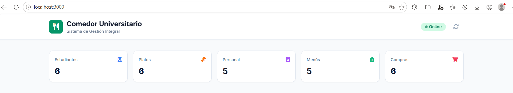
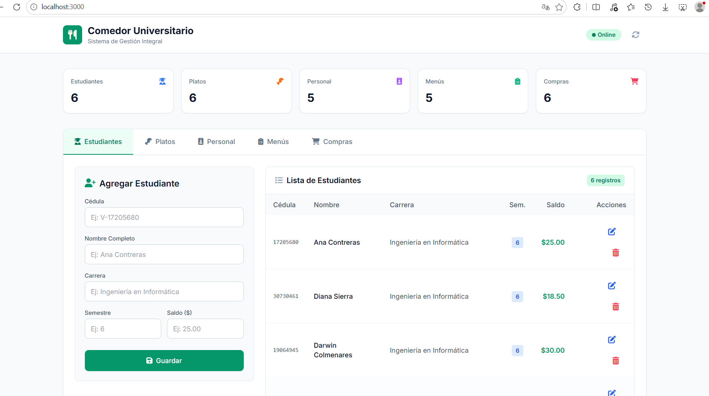
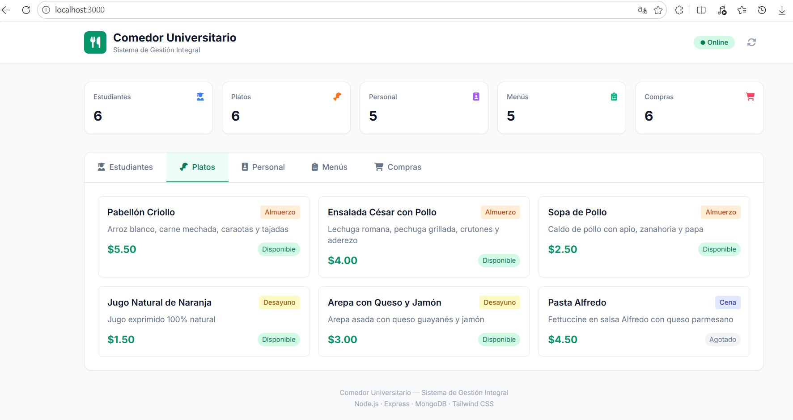
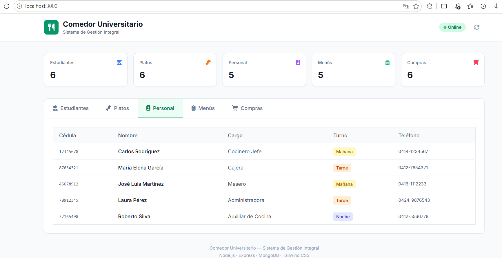
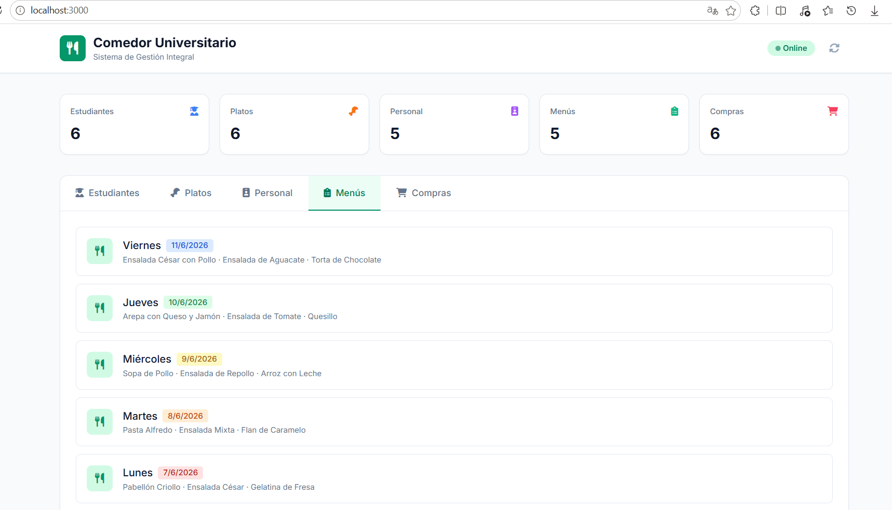
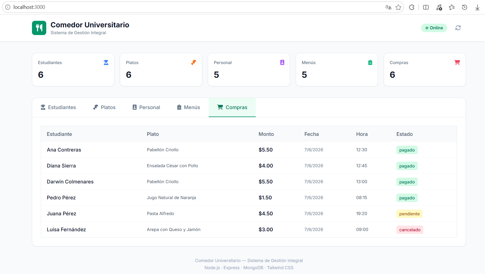
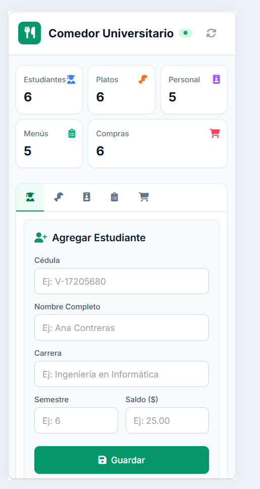
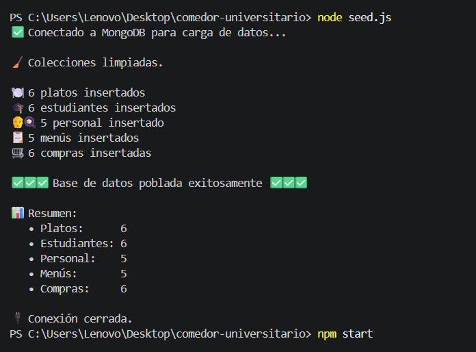
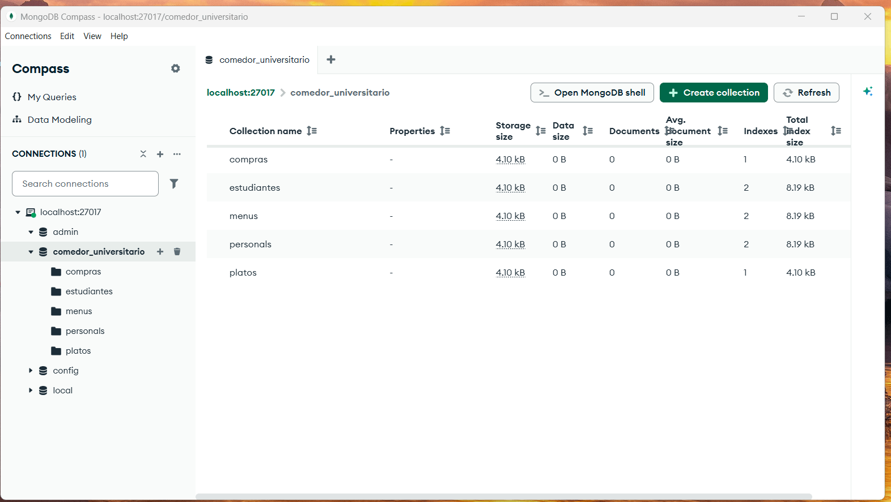
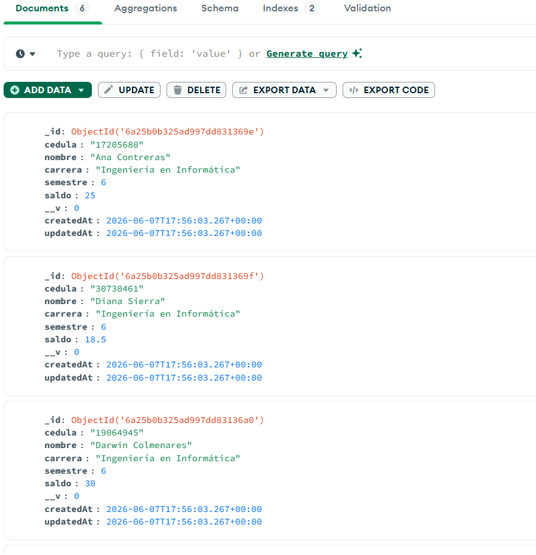

# 🍽️ Comedor Universitario — Sistema de Gestión Integral

<p align="center">
  <a href="https://nodejs.org" target="_blank"></a>
  <a href="https://expressjs.com" target="_blank"></a>
  <a href="https://www.mongodb.com" target="_blank"></a>
  <a href="https://mongoosejs.com" target="_blank"></a>
  <a href="https://tailwindcss.com" target="_blank"></a>
</p>

## 📋 Resumen

Sistema de gestión integral para comedores universitarios. Aplicación full-stack que permite administrar estudiantes, platos, personal, menús semanales y compras en tiempo real, con una interfaz moderna y responsive.



---

## ✨ Características

- **Dashboard en tiempo real** — Estadísticas visuales de todas las colecciones
- **CRUD completo** de estudiantes con validaciones de datos
- **Gestión de platos** con categorías (Desayuno, Almuerzo, Cena) y estado de disponibilidad
- **Control de personal** por turnos (Mañana, Tarde, Noche)
- **Menús semanales** con plato principal, ensalada y postre
- **Registro de compras** con referencias cruzadas a estudiantes y platos
- **Interfaz responsive** — Optimizada para desktop, tablet y móvil
- **Base de datos poblada** automáticamente con datos de prueba

---

## 🖼️ Vista Previa

### Dashboard Principal


### Gestión de Estudiantes (CRUD)


### Catálogo de Platos


### Personal del Comedor


### Menús Semanales


### Registro de Compras


### Vista Móvil Responsive


---

## 🛠️ Stack Tecnológico

| Capa | Tecnología |
|------|------------|
| **Backend** | Node.js + Express.js |
| **Base de Datos** | MongoDB + Mongoose ODM |
| **Frontend** | HTML5 + Tailwind CSS (CDN) + Vanilla JavaScript |
| **Herramientas** | dotenv, CORS, Nodemon |

---

## 🚀 Instalación y Uso

### Requisitos Previos

- [Node.js](https://nodejs.org/) v18 o superior
- [MongoDB Community Server](https://www.mongodb.com/try/download/community) corriendo en `localhost:27017`
- [Git](https://git-scm.com/)

### 1. Clonar el repositorio

```bash
git clone https://github.com/darwinjcn/comedor-universitario.git
cd comedor-universitario
```

### 2. Instalar dependencias

```bash
npm install
```

### 3. Configurar variables de entorno

Crea un archivo `.env` en la raíz del proyecto:

```env
PORT=3000
MONGODB_URI=mongodb://localhost:27017/comedor_universitario
```

### 4. Poblar la base de datos

```bash
npm run seed
```

> Inserta automáticamente datos de prueba en las 5 colecciones: estudiantes, platos, personal, menús y compras.



### 5. Iniciar el servidor

```bash
# Modo desarrollo (con recarga automática)
npm run dev

# Modo producción
npm start
```

El servidor estará disponible en: **http://localhost:3000**

---

## 🗄️ Base de Datos

### Colecciones

| Colección | Documentos | Descripción |
|-----------|------------|-------------|
| `estudiantes` | 6 | Estudiantes registrados con cédula, carrera, semestre y saldo |
| `platos` | 6 | Platos del menú con categoría, precio y disponibilidad |
| `personals` | 5 | Personal del comedor organizado por turnos |
| `menus` | 5 | Menús semanales con plato principal, ensalada y postre |
| `compras` | 6 | Compras registradas con referencias a estudiantes y platos |

### MongoDB Compass





---

## 🌐 API Endpoints

| Método | Endpoint | Descripción |
|--------|----------|-------------|
| `GET` | `/` | Información del sistema |
| `GET` | `/estudiantes` | Listar todos los estudiantes |
| `POST` | `/estudiantes` | Crear estudiante |
| `PUT` | `/estudiantes/:id` | Actualizar estudiante |
| `DELETE` | `/estudiantes/:id` | Eliminar estudiante |
| `GET` | `/platos` | Listar platos |
| `GET` | `/menu` | Listar menús |
| `GET` | `/compras` | Listar compras (con populate) |
| `GET` | `/personal` | Listar personal |

---

## 📁 Estructura del Proyecto

```
comedor-universitario/
├── config/                 # Configuración de base de datos
├── models/                 # Esquemas Mongoose
├── public/                 # Frontend estático
│   ├── index.html         # Interfaz principal
│   └── app.js             # Lógica del cliente
├── routes/                 # Endpoints de la API REST
├── docs/
│   ├── screenshot/        # Capturas del sistema
│   └── *.pdf              # Documentación del proyecto
├── .env                   # Variables de entorno
├── .gitignore
├── app.js                 # Punto de entrada del servidor
├── package.json
├── seed.js                # Script de datos de prueba
└── README.md
```

---

## 🧪 Scripts Disponibles

```bash
npm start       # Inicia el servidor (node app.js)
npm run dev     # Inicia con nodemon (desarrollo)
npm run seed    # Pobla la base de datos con datos de prueba
```

---

## 📱 Responsive Design

La interfaz se adapta automáticamente a cualquier dispositivo:

- **Desktop**: Dashboard completo con tablas y formulario lado a lado
- **Tablet**: Layout optimizado con grids adaptables
- **Móvil**: Tabs scrollables, tarjetas apiladas y touch-friendly

---

## 🔒 Seguridad

- Variables de entorno para configuración sensible (`.env`)
- Validaciones de esquema en Mongoose
- CORS habilitado para desarrollo

---

## 📝 Licencia

ISC

---

<p align="center">
  <strong>Desarrollado con ❤️ usando Node.js, Express y MongoDB</strong>
</p>
